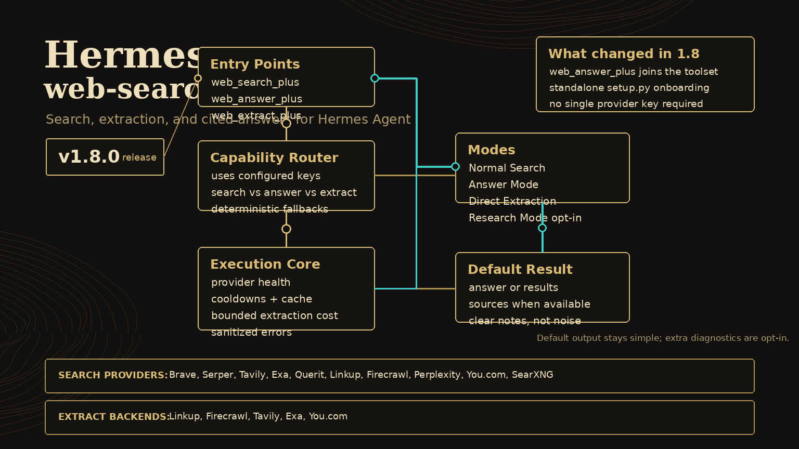

# web-search-plus — Hermes Plugin

<p align="center">
  
</p>

<p align="center">
  <a href="LICENSE"></a>
  
  
</p>

**Web search and citation-ready answers for Hermes — bring any one of 10 provider options and the plugin unlocks the tools your keys can actually support.** Linkup is preferred for extraction, but not required; search-only setups still work and degrade honestly.

`web-search-plus` adds three Hermes tools:

- `web_search_plus` — routed multi-provider web search with quality diagnostics
- `web_answer_plus` — answer-first, citation-ready responses from search + selected source extraction
- `web_extract_plus` — clean URL extraction via provider backends

> Ported from [web-search-plus-plugin](https://github.com/robbyczgw-cla/web-search-plus-plugin) for the [Hermes Agent](https://github.com/NousResearch/hermes-agent) plugin API.

---

## Why this exists

Most web-search tools fail in one of two boring ways: they hard-code a single provider, or they pretend every user has every API key. This plugin is capability-based instead:

- **No global required key.** Configure one search-capable provider and search/answers work.
- **Extraction is additive.** Add Linkup, Firecrawl, Tavily, Exa, or You.com for fuller cited answers and URL extraction.
- **Fallbacks are explicit.** Provider failures go on cooldown; missing extraction keys produce snippet-backed answers with warnings instead of fake confidence.
- **Costs stay bounded.** Research and answer modes cap provider work and keep partial results when extraction fails.

---

## Quick Start

```bash
# 1) Install and enable the Hermes plugin
hermes plugins install robbyczgw-cla/hermes-web-search-plus --enable

# 2) Configure provider keys with the standalone setup wizard
python ~/.hermes/plugins/web-search-plus/setup.py status
python ~/.hermes/plugins/web-search-plus/setup.py setup

# Bare setup prompts every supported provider; press Enter to skip what you do not have.
# Fast starter preset if you want the short path:
# python ~/.hermes/plugins/web-search-plus/setup.py setup --preset starter
# TAVILY_API_KEY=...   # search/research
# LINKUP_API_KEY=...   # extraction + fuller cited answers
# BRAVE_API_KEY=...    # broad independent web search

# 3) Restart/reload Hermes so plugin tools are registered
# CLI: exit and start `hermes` again, or use /reset in-session
# Gateway/Telegram: /restart, then /reset

# 4) Optional shell smoke test
cd ~/.hermes/plugins/web-search-plus
python3 search.py --query "Hermes Agent latest release" --provider auto --quality-report
```

Notes:

- Plugin install clones into `~/.hermes/plugins/web-search-plus`.
- Keys are written to the active Hermes environment file by the setup helper; they should never be committed to the repo.
- Python 3.8+ is required. Normal Hermes plugin installation handles runtime dependencies; manual development can use `python3 -m pip install -r requirements.txt` inside the Hermes/plugin environment.

---

## CLI setup

The setup wizard is intentionally nicer than “paste keys and pray”:

```bash
python ~/.hermes/plugins/web-search-plus/setup.py status
python ~/.hermes/plugins/web-search-plus/setup.py list
python ~/.hermes/plugins/web-search-plus/setup.py setup
python ~/.hermes/plugins/web-search-plus/setup.py setup --preset starter --open
python ~/.hermes/plugins/web-search-plus/setup.py setup brave linkup --env-path ~/.hermes/.env
```

Presets:

- default / `all` — prompt every supported provider; Enter skips missing keys.
- `starter` — Tavily + Linkup + Brave; best first-run setup.
- `lean` — Tavily + Linkup; cheapest useful search + extraction pairing.
- `search` — Tavily + Brave + Serper; broad search coverage.
- `extract` — Linkup + Firecrawl + Tavily; extraction-heavy setup.
- `all` — prompt for every supported provider.

The CLI never prints secret values. It writes keys into the active Hermes `.env` file, then reminds you to restart Hermes or run `/reset` so the tools re-register.

---

## Capability model

| Capability | Unlocks | Configure at least one of |
|---|---|---|
| Search | `web_search_plus`, snippet-backed `web_answer_plus` | Brave, Serper, Tavily, Exa, Querit, Linkup, Firecrawl, Perplexity, You.com, or SearXNG |
| Extraction | `web_extract_plus`, fuller `web_answer_plus` citations | Linkup, Firecrawl, Tavily, Exa, or You.com |
| Best starter | Search + extraction + broad fallback | Tavily + Linkup + optional Brave |

`setup.py status --plain` reports this directly:

```text
web-search-plus is configured. Providers: Linkup, Brave Search
Capabilities: search=yes, extraction=yes, answer=yes
```

---

## Tool overview

### `web_answer_plus`

Use this when the user wants the answer, not just raw search results.

```python
web_answer_plus(query="What changed in Hermes Agent this week?")
# → answer + sources + confidence/freshness metadata

web_answer_plus(
    query="Best DAC amps under 500 EUR in Austria",
    mode="deep",
    sources=6,
    country="AT",
)
# → broader research-mode answer with Austrian locale hint

web_answer_plus(query="OpenAI latest model announcements", freshness="week", output="brief")
# → short answer scoped to recent results

web_answer_plus(query="Sources about Linkup extraction pricing", output="sources")
# → sources-only list
```

Defaults are intentionally conservative:

- `quick` mode asks for 3 sources and extracts up to 2 URLs.
- `deep` mode asks for 6 sources and uses research mode, with extraction still hard-capped at 5 URLs.
- `freshness="auto"` applies recency filters only when the query looks current/news/date-sensitive.
- Linkup is preferred for extraction; other extraction providers are used through the normal fallback chain.
- If no extraction provider is configured, answers are snippet-backed and carry an explicit warning.

Parameters:

| Parameter | Type | Default | Description |
|---|---|---|---|
| `query` | string | **required** | Question or research query to answer from the web |
| `mode` | string | `"quick"` | `quick` or `deep` |
| `sources` | integer | quick `3`, deep `6` | Citation-ready sources to return, max 10 |
| `freshness` | string | `"auto"` | `auto`, `none`, `day`, `week`, `month`, `year` |
| `output` | string | `"answer"` | `answer`, `brief`, `sources`, or `json` |
| `language` | string | `"auto"` | Optional language code such as `de`, `en`, `es`, `fr` |
| `country` | string | `"auto"` | Optional country/region code such as `AT`, `DE`, `US` |
| `max_extracts` | integer | `2` | Advanced cost guard; hard-capped at 5 |

### `web_search_plus`

Use this when the agent needs search results and routing metadata.

```python
web_search_plus(query="Graz weather today")
# → auto-routed current-info search

web_search_plus(query="Singapore CPI latest", provider="brave")
# → force Brave Search

web_search_plus(query="alternatives to Notion", provider="exa")
# → semantic discovery

web_search_plus(query="compare recent reviews of turntables under 1000", mode="research", research_time_budget=45)
# → opt-in multi-provider research; keeps partial results if extraction hits errors/budget

web_search_plus(query="best bookshelf speakers under 1000", quality_report=True)
# → normal search plus routing/result-quality diagnostics
```

Parameters:

| Parameter | Type | Default | Description |
|---|---|---|---|
| `query` | string | **required** | Search query |
| `provider` | string | `"auto"` | `auto`, `serper`, `brave`, `tavily`, `exa`, `querit`, `linkup`, `firecrawl`, `perplexity`, `you`, `searxng` |
| `depth` | string | `"normal"` | Exa only: `normal`, `deep`, `deep-reasoning` |
| `count` | integer | `5` | Results, 1–20 |
| `time_range` | string | — | `day`, `week`, `month`, `year` |
| `include_domains` | string[] | — | Restrict search to domains |
| `exclude_domains` | string[] | — | Exclude domains |
| `quality_report` | boolean | `false` | Include routing diagnostics, provider scores, result counts, and extraction recommendation |
| `mode` | string | `"normal"` | `normal` or opt-in `research` |
| `research_time_budget` | number | `55.0` | Best-effort seconds budget for research mode |

### `web_extract_plus`

Use this when you already have URLs and want clean content.

```python
web_extract_plus(urls=["https://example.com"], provider="firecrawl")
# → extract clean markdown from a URL

web_extract_plus(urls=["https://docs.linkup.so"], provider="linkup", render_js=False)
# → Linkup fetch endpoint
```

Auto extraction currently tries Firecrawl, then Linkup, Tavily, Exa, and You.com when keys are available.

Parameters:

| Parameter | Type | Default | Description |
|---|---|---|---|
| `urls` | string[] | **required** | URLs to extract |
| `provider` | string | `"auto"` | `auto`, `firecrawl`, `linkup`, `tavily`, `exa`, `you` |
| `format` | string | `"markdown"` | `markdown` or `html` |
| `include_images` | boolean | `false` | Include image metadata when supported |
| `include_raw_html` | boolean | `false` | Include raw HTML when supported |
| `render_js` | boolean | `false` | Render JavaScript before extraction when supported |

---

## Providers

| Provider | Search | Extract | Best for |
|---|---:|---:|---|
| Brave | ✅ | — | General-purpose independent web index |
| Serper | ✅ | — | Google-like SERP, news, shopping, local facts |
| Tavily | ✅ | ✅ | Long-form research and content-heavy queries |
| Exa | ✅ | ✅ | Semantic discovery and similarity search |
| Querit | ✅ | — | Multilingual and real-time queries |
| Linkup | ✅ | ✅ | Source-backed grounding, citations, RAG-ready retrieval |
| Firecrawl | ✅ | ✅ | Web search with scrape-ready result content |
| Perplexity | ✅ | — | Direct answer-style search |
| You.com | ✅ | ✅ | LLM-ready real-time snippets and content |
| SearXNG | ✅ | — | Privacy-focused self-hosted metasearch |

Auto-routing is rule-based on query signals such as recency, product intent, research language, and semantic-discovery patterns. Brave and Serper share generic web-search intents; when they tie, deterministic per-query tie-breaking keeps the same query reproducible while distributing ties across both providers.

---

## API keys

All provider keys are optional at install time. Configure only what you use:

```bash
# Search-capable providers
SERPER_API_KEY=***        # https://serper.dev
BRAVE_API_KEY=***         # https://brave.com/search/api/
TAVILY_API_KEY=***        # https://tavily.com — search + extraction
EXA_API_KEY=***           # https://exa.ai — search + extraction
QUERIT_API_KEY=***        # https://querit.ai
LINKUP_API_KEY=***        # https://linkup.so — search + preferred extraction
FIRECRAWL_API_KEY=***     # https://firecrawl.dev — search + extraction
PERPLEXITY_API_KEY=***    # https://perplexity.ai/settings/api
YOU_API_KEY=***           # https://api.you.com — search + extraction
SEARXNG_INSTANCE_URL=https://your-instance.example.com

# Advanced alternate credential path for the perplexity provider via Kilo Gateway
KILOCODE_API_KEY=***
```

---

## Reliability and cost controls

- **Provider cooldowns:** failed providers are skipped for 1 hour before retry.
- **Research budget:** `mode="research"` checks the wall-clock budget between provider calls and extraction steps.
- **Answer extraction cap:** `web_answer_plus` never extracts more than 5 URLs per call.
- **Partial results:** search results already collected are preserved if extraction fails or times out.
- **Truthful warnings:** missing extraction keys, quota failures, empty results, and budget exhaustion appear in response metadata.

---

## Local development

```bash
cd ~/.hermes/plugins/web-search-plus
python3 -m pip install -r requirements.txt
python3 -m pytest -q
python3 -m compileall -q __init__.py search.py setup.py scripts tests
```

Useful smoke tests:

```bash
python3 setup.py list --json
python3 setup.py status
python3 search.py --query "Hermes Agent latest release" --provider auto --quality-report --compact
python3 search.py --query "Hermes Agent latest release" --provider brave --max-results 2 --compact
```

---

## Project layout

```text
__init__.py      Hermes plugin entry, tool schemas, handlers, answer/onboarding helpers
search.py        Provider engine, routing, caching, fallback, CLI
setup.py         Standalone provider onboarding helper
scripts/         Golden query evaluator and support scripts
tests/           Unit and regression tests
plugin.yaml      Plugin manifest
CHANGELOG.md     Version history
LICENSE          MIT license
```

---

## License

MIT — see [LICENSE](LICENSE).

## Related

- [web-search-plus-plugin](https://github.com/robbyczgw-cla/web-search-plus-plugin) — TypeScript/OpenClaw version
- [Hermes Agent](https://github.com/NousResearch/hermes-agent) — the agent runtime this plugin extends
